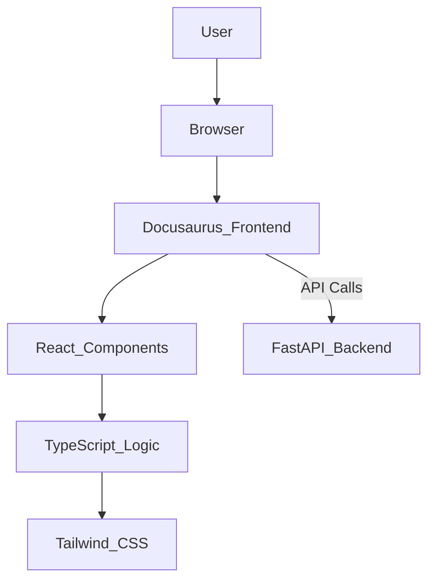
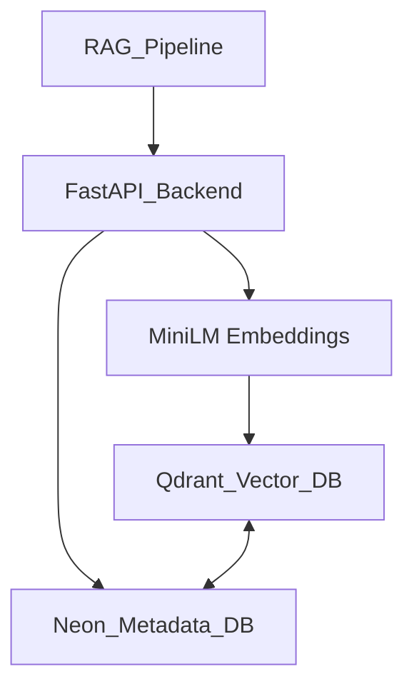
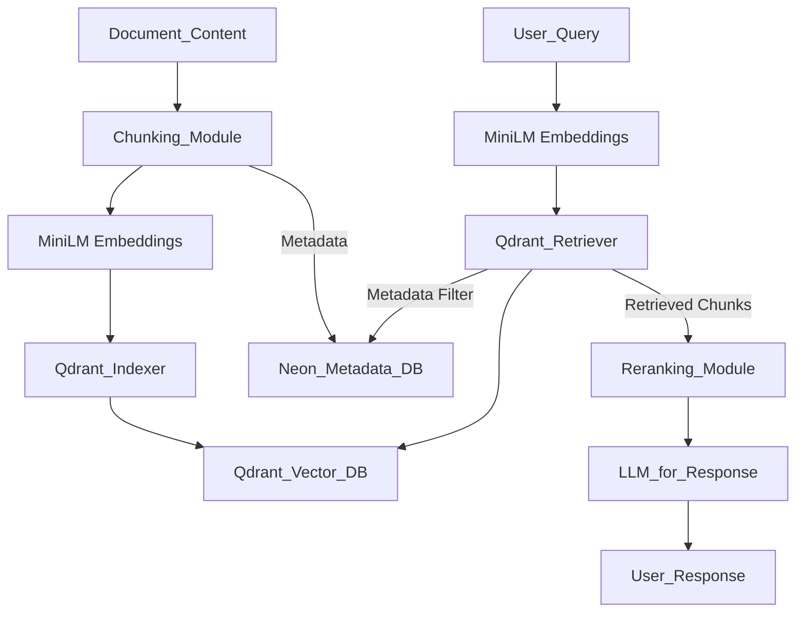

# Implementation Plan: AI-Native Textbook on Physical AI & Humanoid Robotics

## 1. Architecture Blueprint

### Frontend Architecture (Docusaurus 3.x, React 18, TypeScript)
- **Framework**: Docusaurus 3.x for static site generation, documentation-as-code.
- **UI Library**: React 18 for interactive components.
- **Language**: TypeScript for type safety and better developer experience.
- **Styling**: Tailwind CSS for utility-first styling, integrated with Docusaurus.
- **Deployment**: GitHub Pages.



### Backend Architecture (FastAPI, Embeddings, Qdrant, Neon metadata)
- **Framework**: FastAPI for high-performance Python API.
- **Embeddings**: Sentence-BERT (MiniLM-L6-v2) for generating text embeddings.
- **Vector Database**: Qdrant for efficient vector storage and similarity search.
- **Metadata Storage**: Neon (PostgreSQL-compatible) for structured metadata associated with document chunks.
- **Deployment**: Railway.



### RAG Pipeline Architecture (Chunking → Embeddings → Storage → Retrieval → Reranking)
- **Chunking**: Text is split into fixed-size chunks (e.g., 512 tokens with 50 token overlap).
- **Embeddings**: Each chunk is converted into a vector embedding using MiniLM-L6-v2.
- **Storage**: Embeddings are stored in Qdrant; associated metadata (source, chapter, page) in Neon.
- **Retrieval**: User query is embedded; similar chunks retrieved from Qdrant, filtered by metadata from Neon.
- **Reranking**: (Optional) A cross-encoder or a simpler heuristic can be used to re-rank retrieved chunks for higher relevance.



## 2. Project Structure

```
.
├── .specify/
├── docs/                                 # Docusaurus documentation content (12 chapters)
│   ├── chapter1.md
│   ├── chapter2.md
│   └── ...
├── src/                                  # Docusaurus frontend source
│   ├── components/                       # React components (e.g., ChatWindow, ChapterNavigator)
│   ├── layouts/                          # Custom Docusaurus layouts
│   ├── hooks/                            # Custom React hooks
│   ├── providers/                        # React context providers (e.g., AuthProvider, ThemeProvider)
│   └── css/                              # Tailwind CSS configuration and custom styles
├── rag-pipeline/                         # Python scripts for RAG pipeline (chunking, embedding, indexing)
│   ├── __init__.py
│   ├── chunking.py                       # Text chunking logic
│   ├── embeddings.py                     # Embedding generation (MiniLM)
│   ├── indexing.py                       # Qdrant indexing script
│   └── utils.py                          # Utility functions
├── fastapi-backend/                      # FastAPI application
│   ├── __init__.py
│   ├── main.py                           # FastAPI application entry point
│   ├── api/                              # API endpoints (e.g., /chat, /health)
│   ├── services/                         # Business logic and external service integrations (Qdrant, Neon)
│   ├── models/                           # Pydantic models for request/response
│   └── config.py                         # Application configuration
├── config/                               # Project-wide configuration
│   ├── docusaurus.config.js
│   ├── tailwind.config.js
│   └── environment.env.example
├── scripts/                              # Miscellaneous scripts (e.g., data ingestion, deployment)
│   ├── index_docs.py                     # Script to trigger the RAG pipeline indexing
│   └── deploy.sh                         # Deployment automation
├── tests/
│   ├── frontend/                         # Jest/React Testing Library tests for Docusaurus components
│   ├── backend/                          # Pytest tests for FastAPI
│   ├── rag/                              # Tests for chunking, embeddings, retrieval quality
│   └── e2e/                              # Playwright/Cypress for end-to-end tests
└── package.json                          # Frontend dependencies
└── requirements.txt                      # Backend dependencies
```

### Auto-generated Sidebar Structure
Docusaurus will automatically generate a sidebar based on the `docs` folder structure and `sidebar.js` configuration, ensuring chapters are ordered correctly.

## 3. Implementation Steps (Sequenced)

1.  **Setup Repository & Environment:**
    *   Initialize Git repository.
    *   Create project directory structure as defined above.
    *   Set up basic `.gitignore`, `README.md`, `LICENSE`.
    *   Install Node.js/npm and Python/pipenv/poetry.

2.  **Initialize Docusaurus Frontend:**
    *   `npx create-docusaurus@latest website classic --typescript`
    *   Configure `docusaurus.config.js` with basic site metadata, theme, and plugins.
    *   Integrate Tailwind CSS with PostCSS.

3.  **Create Chapter Structure:**
    *   Create 12 placeholder markdown files in `docs/` (e.g., `docs/chapter1.md`, `docs/chapter2.md`).
    *   Configure `sidebars.js` for ordered chapter navigation.

4.  **Build UI Layout & Theme:**
    *   Customize Docusaurus theme (`src/css/custom.css`, `src/theme/`).
    *   Develop core React components (e.g., `ChatWindow` placeholder, `ChapterNavigator`).
    *   Implement responsive design.

5.  **Build FastAPI Backend Core:**
    *   Initialize FastAPI project (`fastapi-backend/`).
    *   Define basic `main.py`, `config.py`.
    *   Implement health check endpoint (`/health`).
    *   Set up Dockerfile for FastAPI (optional, but good for deployment).

6.  **Create Embeddings Pipeline:**
    *   Implement text chunking logic (`rag-pipeline/chunking.py`).
    *   Develop embedding generation using MiniLM-L6-v2 (`rag-pipeline/embeddings.py`).
    *   Create script to process Docusaurus markdown files into chunks and embeddings (`rag-pipeline/indexing.py`).

7.  **Setup Qdrant & Neon:**
    *   Set up local Qdrant instance (Docker or standalone).
    *   Provision Neon PostgreSQL database.
    *   Develop Python client for Qdrant interaction (`fastapi-backend/services/qdrant.py`).
    *   Develop Python client for Neon (SQLAlchemy/Psycopg2) for metadata storage (`fastapi-backend/services/neon_db.py`).
    *   Integrate Qdrant and Neon clients into `rag-pipeline/indexing.py`.

8.  **Implement Chat Endpoints in FastAPI:**
    *   Create `/chat` endpoint in `fastapi-backend/api/`.
    *   Implement retrieval logic:
        *   Embed user query.
        *   Query Qdrant for top-k similar chunks, filtered by metadata from Neon.
        *   Construct prompt for LLM using retrieved chunks.
        *   Call LLM (e.g., through OpenAI/Anthropic API, or local model if available).
        *   Parse LLM response and return.

9.  **Integrate Frontend with RAG API:**
    *   Develop `ChatWindow` component in Docusaurus frontend.
    *   Implement API calls from `ChatWindow` to FastAPI `/chat` endpoint.
    *   Display chatbot responses in the UI.
    *   Handle streaming responses (if LLM supports it).

10. **Testing, Optimization, Deployment:**
    *   Write unit, integration, and RAG quality tests.
    *   Implement citation accuracy tests for chatbot.
    *   Conduct performance profiling (frontend FCP, TTI, backend latency).
    *   Optimize Docusaurus build and bundle size.
    *   Set up CI/CD for GitHub Pages (frontend) and Railway (backend).

## 4. Technical Decisions (ADR-style)

*   **Why Docusaurus?**
    *   **Decision**: Docusaurus 3.x is chosen for the textbook frontend.
    *   **Rationale**: Excellent for documentation sites, provides out-of-the-box features like sidebar generation, search, versioning, and MDX support. Built on React, allowing for easy integration of interactive components. Strong community support and actively maintained.
    *   **Alternatives Considered**: Next.js (overkill for static docs), Gatsby (learning curve for static site), raw React (more boilerplate).

*   **Why MiniLM Embeddings?**
    *   **Decision**: `all-MiniLM-L6-v2` Sentence-BERT model is chosen for embeddings.
    *   **Rationale**: Excellent balance of performance (speed and accuracy) and size, making it suitable for CPU-only inference and free-tier deployment constraints. It's pre-trained for semantic similarity, which is crucial for RAG.
    *   **Alternatives Considered**: Larger Sentence-BERT models (too slow/resource-intensive), OpenAI embeddings (cost implications, API dependency), custom fine-tuned models (development effort).

*   **Why Qdrant + Neon?**
    *   **Decision**: Qdrant for vector storage and Neon (PostgreSQL) for metadata.
    *   **Rationale**: Qdrant is an open-source, high-performance vector database with strong filtering capabilities crucial for RAG. It allows for efficient similarity search. Neon provides a serverless PostgreSQL solution, ideal for storing structured metadata (chapter, section, source) associated with document chunks, enabling powerful pre- and post-retrieval filtering. Combining both leverages their strengths.
    *   **Alternatives Considered**: Pinecone/Weaviate (managed, but potentially higher cost), raw PostgreSQL + `pgvector` (less performant for pure vector search at scale), dedicated NoSQL for metadata (adds complexity).

*   **Why Chunk Size 512 / Overlap 50?**
    *   **Decision**: Document chunks will be 512 tokens with an overlap of 50 tokens.
    *   **Rationale**: This size is a common heuristic for RAG systems, balancing the need for sufficient context within a chunk with the desire to keep chunks small enough for efficient embedding and retrieval. The overlap helps maintain context across chunk boundaries, reducing the chance of losing critical information split between chunks.
    *   **Alternatives Considered**: Smaller chunks (risk of losing context), larger chunks (increases embedding cost/time, might dilute relevance), no overlap (context discontinuity).

*   **Why CPU-Only? (Free-tier alignment)**
    *   **Decision**: All backend computations, including embedding generation, will be CPU-only.
    *   **Rationale**: Aligns with free-tier cloud deployment constraints (e.g., Railway, Hugging Face Spaces free tier). Avoids the cost and complexity of GPU provisioning, making the solution more accessible and cost-effective for a personal project.
    *   **Alternatives Considered**: GPU acceleration (faster embeddings but higher cost, more complex setup).

*   **Why FastAPI over others?**
    *   **Decision**: FastAPI is chosen for the backend API framework.
    *   **Rationale**: Provides extremely high performance (on par with Node.js and Go), built-in data validation with Pydantic, automatic OpenAPI (Swagger) documentation, and asynchronous support out of the box. This makes it efficient for I/O-bound tasks like interacting with Qdrant and Neon, and calling LLM APIs. Python's rich ecosystem for NLP and machine learning also makes it ideal for the RAG components.
    *   **Alternatives Considered**: Flask (more boilerplate, less performance), Django (overkill for simple API, more complex ORM), Node.js (less mature ML ecosystem).

## 5. Milestones

*   **M1: Documentation Framework Scaffolded (Target: Week 2)**
    *   Docusaurus initialized and configured.
    *   Tailwind CSS integrated.
    *   Basic Docusaurus theme customized (header, footer, fonts).
    *   Empty `docs/` folder with placeholder `chapter1.md`.
    *   Repository structure established.

*   **M2: Core 12-Chapter Structure Ready (Target: Week 4)**
    *   All 12 chapter markdown files created in `docs/` with basic headings.
    *   Docusaurus sidebar correctly configured for all chapters.
    *   Basic navigation between chapters working.
    *   Core UI layouts and components for chapter display implemented.

*   **M3: RAG Backend Running Locally (Target: Week 8)**
    *   FastAPI backend with `/health` endpoint deployed locally.
    *   Qdrant and Neon databases set up locally.
    *   RAG pipeline scripts (chunking, embeddings, indexing) functional for sample data.
    *   Initial documentation content indexed into Qdrant and Neon.
    *   Basic retrieval from Qdrant/Neon via FastAPI service.

*   **M4: Chatbot Integrated with UI (Target: Week 10)**
    *   FastAPI `/chat` endpoint fully implemented, integrating with LLM.
    *   Docusaurus `ChatWindow` component developed.
    *   Frontend successfully sends queries to `/chat` and displays responses.
    *   Basic RAG quality tests pass.

*   **M5: Deployment (GitHub Pages + Railway) (Target: Week 12)**
    *   Docusaurus frontend deployed to GitHub Pages.
    *   FastAPI backend deployed to Railway.
    *   Qdrant and Neon provisioned on cloud (Railway/Neon free tier).
    *   End-to-end chatbot functionality live and accessible.
    *   All key performance metrics monitored.

## 6. Performance & Resource Budgets

*   **Frontend (Docusaurus)**
    *   **First Contentful Paint (FCP)**: < 1.5 seconds
    *   **Time to Interactive (TTI)**: < 2.5 seconds
    *   **Largest Contentful Paint (LCP)**: < 2.5 seconds
    *   **Build Time**: < 3 minutes on CI/CD (GitHub Actions)

*   **Backend (FastAPI)**
    *   **Chat Endpoint Latency (p95)**: < 500 ms (excluding LLM call, which is external)
    *   **Indexing Latency**: < 1 second per document (for average chapter size)
    *   **Rate Limits**: 10 requests/second per IP for chat endpoint.

*   **Vector Database (Qdrant)**
    *   **Database Size Budget**: < 1 GB (for embeddings, potentially larger for growing content).
    *   **Query Latency (p95)**: < 50 ms.

*   **Metadata Database (Neon)**
    *   **Database Size Budget**: < 0.5 GB (for structured metadata).
    *   **Query Latency (p95)**: < 20 ms.

*   **General**
    *   **CPU Usage**: Max 80% on a single core (free-tier constraint).
    *   **Memory Usage**: Max 512 MB (free-tier constraint).

## 7. Risks & Mitigations

1.  **RAG Hallucination**:
    *   **Risk**: Chatbot generates factually incorrect or unsupported responses.
    *   **Mitigation**: Implement strict citation mechanisms, prompt engineering to emphasize grounding in retrieved documents, integrate a confidence score or "I don't know" response, implement RAG quality tests that check for citation accuracy and factual correctness.

2.  **Slow Embeddings/Retrieval**:
    *   **Risk**: Embedding generation or Qdrant retrieval becomes a bottleneck, leading to high latency.
    *   **Mitigation**: Use efficient, compact embedding models (MiniLM-L6-v2), optimize Qdrant indexing (batching, appropriate indexing settings), ensure Qdrant and Neon are well-provisioned and indexed, consider caching retrieved results for popular queries.

3.  **Free-tier Outages/Limitations**:
    *   **Risk**: Cloud provider free tiers (Railway, GitHub Pages, Neon) might have downtime or unexpected resource limits.
    *   **Mitigation**: Monitor service status closely, design for graceful degradation (e.g., if chatbot fails, still display documentation), have a plan for upgrading to paid tiers if necessary, use multiple free-tier providers for redundancy (if applicable and cost-effective).

4.  **UI Performance Degradation**:
    *   **Risk**: Docusaurus frontend becomes slow or unresponsive with more content/components.
    *   **Mitigation**: Implement React best practices (memoization, lazy loading components), optimize image assets, monitor Lighthouse scores in CI/CD, conduct regular performance audits, analyze Webpack bundles.

5.  **Sidebar Generation Errors**:
    *   **Risk**: Docusaurus sidebar fails to generate correctly or misorders chapters.
    *   **Mitigation**: Strictly follow Docusaurus sidebar configuration best practices, use consistent naming conventions for `docs/` files, implement CI checks to build Docusaurus and detect rendering errors.

6.  **Chatbot Rate Limiting (LLM API)**:
    *   **Risk**: Exceeding rate limits for external LLM APIs (e.g., OpenAI, Anthropic).
    *   **Mitigation**: Implement client-side and server-side rate limiting, use API keys with sufficient quotas, design a queueing/retry mechanism for LLM calls, educate users on potential delays.

7.  **Metadata Corruption/Inconsistency**:
    *   **Risk**: Discrepancies between Qdrant vector data and Neon metadata, or corrupted metadata.
    *   **Mitigation**: Implement strong data validation during indexing, use transactions for atomic updates across Qdrant and Neon (if possible), regularly reconcile/validate data integrity, implement backups for Neon.

8.  **Indexing Failures**:
    *   **Risk**: The RAG pipeline fails to correctly chunk, embed, or index new/updated documentation.
    *   **Mitigation**: Implement robust error handling and logging in indexing scripts, add monitoring for indexing job status, design a retry mechanism for failed document processing, implement checksums for indexed content to detect partial updates.

## 8. Testing Strategy

*   **Unit Tests**:
    *   **Frontend**: Jest and React Testing Library for individual React components, utility functions, and hooks.
    *   **Backend**: Pytest for FastAPI routes, service functions, and helper modules.
    *   **RAG Pipeline**: Pytest for chunking logic, embedding generation (mocking external models), and Qdrant/Neon client interactions.

*   **Integration Tests**:
    *   **Frontend-Backend API**: Test full API call flows from Docusaurus components to FastAPI endpoints.
    *   **RAG System**: Test the entire RAG flow from query embedding to retrieval from Qdrant/Neon.
    *   **Database Interactions**: Verify correct data storage and retrieval from Qdrant and Neon.

*   **RAG Quality Tests**:
    *   **Context Retrieval**: For a given set of questions, verify that the top-k retrieved chunks contain the necessary information to answer.
    *   **Relevance Scoring**: Evaluate if the ranking of retrieved documents aligns with expected relevance.
    *   **Answer Grounding**: Automatically check if generated chatbot answers are directly supported by the retrieved contexts.

*   **Citation Accuracy Tests**:
    *   For questions where direct citations are expected, verify that the chatbot provides accurate and verifiable source links (e.g., `docs/chapterX.md`).

*   **Latency Tests**:
    *   Measure response times for key FastAPI endpoints (`/chat`, `/health`).
    *   Measure Docusaurus build times.
    *   Measure FCP, TTI, LCP for Docusaurus frontend using Lighthouse or similar tools.

*   **Accessibility & Lighthouse Tests**:
    *   Integrate Lighthouse CI into the Docusaurus build process to ensure accessibility, performance, best practices, and SEO.
    *   Manual accessibility testing with screen readers and keyboard navigation.
